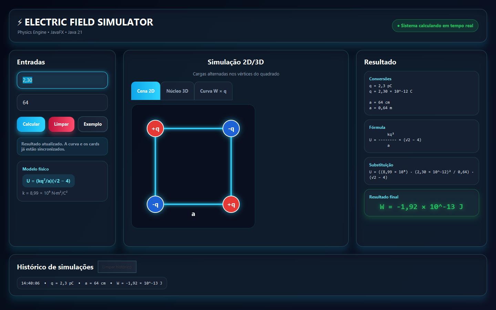
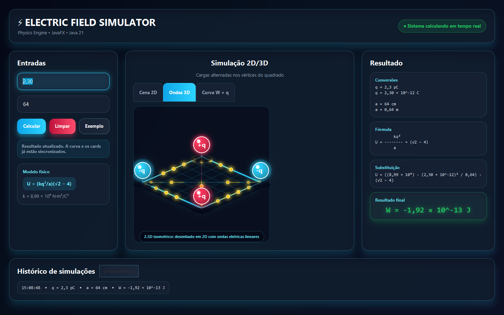
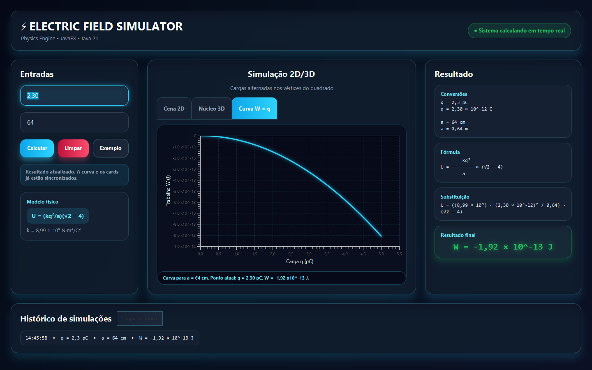

# Calculadora de Trabalho para Montagem de Cargas Eletricas

Aplicacao desktop desenvolvida em **Java 21 + JavaFX** para calcular o trabalho necessario para montar um sistema de quatro cargas eletricas posicionadas nos vertices de um quadrado.

Este projeto foi organizado como trabalho universitario, com separacao entre interface, desenho grafico e calculo fisico.

## Objetivo

Permitir que o usuario informe:

- valor da carga `q` em picoCoulombs (`pC`);
- lado do quadrado `a` em centimetros (`cm`);
- e receba o trabalho `W`, em Joules (`J`), usando a energia potencial eletrica total do arranjo.

## Formula

O trabalho necessario para montar o sistema e igual a energia potencial eletrica total:

```text
W = U

U = 4(-kq²/a) + 2(kq²/(a√2))

U = (kq²/a)(√2 - 4)
```

Onde:

```text
k = 8,99 × 10^9 N·m²/C²
```

Conversoes usadas:

```text
1 pC = 10^-12 C
1 cm = 10^-2 m
```

## Interface

A aplicacao possui tres regioes principais:

- painel esquerdo: entrada de `q`, entrada de `a`, calculo automatico, botao Calcular, botao Limpar e botao Exemplo;
- painel central: abas com representacao 2D, visualizacao 3D interativa e grafico `W x q`;
- painel direito: formula, conversoes, substituicao dos valores e resultado final.



### Visualizacao 3D

O projeto tambem inclui uma visualizacao 3D interativa das cargas nos vertices do quadrado, com particulas de fluxo, diagonais de interacao, rotacao por mouse e zoom por scroll:



### Grafico

A aba de grafico mostra como o trabalho varia em funcao da carga `q`, mantendo o valor informado para o lado `a`:



## Exemplo de calculo

Entrada:

```text
q = 2,30 pC
a = 64 cm
```

Conversoes:

```text
q = 2,30 × 10^-12 C
a = 0,64 m
```

Resultado aproximado:

```text
W = -1,92 × 10^-13 J
```

## PDF explicativo

O projeto inclui um PDF com a explicacao passo a passo do calculo:

```text
docs/calculo-cargas-eletricas.pdf
```

O texto fonte tambem esta disponivel em:

```text
docs/CALCULO_EXPLICADO.md
```

## Estrutura do projeto

```text
src/
├── Main.java
├── model/
│   └── PhysicsCalculator.java
├── view/
│   ├── MainView.java
│   ├── ChargeSquarePane.java
│   ├── ChargeSquare3DPane.java
│   └── WorkGraphPane.java
└── resources/
    └── style.css
```

## Classes principais

| Classe | Responsabilidade |
| --- | --- |
| `Main.java` | Inicializa a aplicacao JavaFX, cria a cena e aplica o CSS. |
| `MainView.java` | Monta a interface, valida entradas, chama o calculo e exibe o resultado. |
| `PhysicsCalculator.java` | Centraliza as constantes, conversoes e o resultado completo do calculo. |
| `ChargeSquarePane.java` | Desenha o quadrado, as linhas, as cargas e o rotulo do lado `a`. |
| `ChargeSquare3DPane.java` | Exibe a visualizacao 3D interativa do arranjo de cargas. |
| `WorkGraphPane.java` | Exibe o grafico do trabalho em funcao da carga. |

## Requisitos

- Java JDK 21
- Windows PowerShell, para usar os scripts `build.ps1`, `run.ps1` e `package.ps1`
- Linux com Bash, para usar `package-linux.sh`
- Opcional: IntelliJ IDEA
- Opcional: Maven, se preferir executar pelo `pom.xml`

## Como executar

No PowerShell:

```powershell
.\run.ps1
```

O script `run.ps1` chama `build.ps1`, que:

1. verifica se o JavaFX SDK 21.0.4 existe em `lib/`;
2. baixa e extrai o SDK automaticamente se ele ainda nao existir;
3. compila os arquivos Java em `out/classes`;
4. executa a classe `Main`.

## Como gerar o executavel

No PowerShell:

```powershell
.\package.ps1
```

O script cria uma versao executavel em:

```text
dist/CalculadoraCargas/CalculadoraCargas.exe
```

Tambem cria um atalho simples de duplo clique:

```text
dist/CalculadoraCargas/Abrir CalculadoraCargas.cmd
```

Tambem cria um arquivo compactado para entrega:

```text
dist/CalculadoraCargas-windows.zip
```

Para abrir o programa sem IntelliJ, extraia o ZIP e clique em:

```text
Abrir CalculadoraCargas.cmd
```

Tambem e possivel abrir diretamente `CalculadoraCargas.exe`.

## Como gerar o app Linux

Em um Linux com JDK 21:

```bash
bash package-linux.sh
```

O script cria:

```text
dist-linux/CalculadoraCargas/Abrir CalculadoraCargas.sh
dist-linux/CalculadoraCargas-linux.tar.gz
```

Para usar, extraia o `.tar.gz` e clique em `Abrir CalculadoraCargas.sh`, ou execute pelo terminal:

```bash
./Abrir\ CalculadoraCargas.sh
```

Observacao: o pacote Linux precisa ser gerado em Linux. O Windows nao consegue criar um app Linux nativo com `jpackage`.

## Como executar pelo IntelliJ IDEA

1. Abra esta pasta como projeto.
2. Configure o SDK do projeto como Java 21.
3. Se usar Maven, aguarde a importacao das dependencias do `pom.xml`.
4. Execute a classe `Main`.

Se o IntelliJ nao reconhecer o JavaFX automaticamente, use a configuracao de VM:

```text
--module-path lib/javafx-sdk-21.0.4/lib --add-modules javafx.controls
```

## Como executar pelo Maven

Se o Maven estiver instalado:

```bash
mvn javafx:run
```

## Validacoes implementadas

- campos obrigatorios;
- impedimento de valores menores ou iguais a zero;
- suporte a numeros decimais com virgula ou ponto;
- mensagens de erro amigaveis;
- resultado em notacao cientifica.
- calculo automatico enquanto o usuario digita.

## Observacao sobre arquivos gerados

As pastas `lib/`, `out/` e `target/` nao devem ser versionadas. Elas sao geradas localmente durante a execucao ou compilacao.
