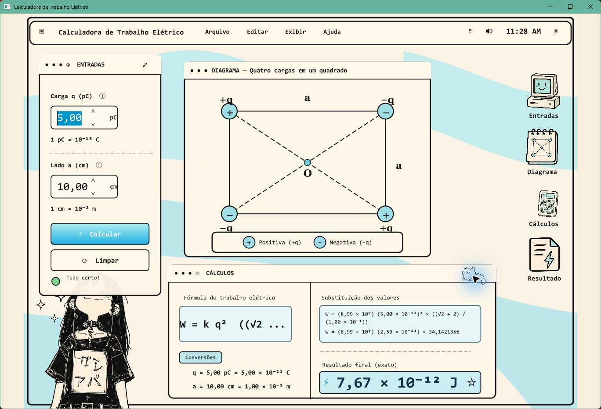
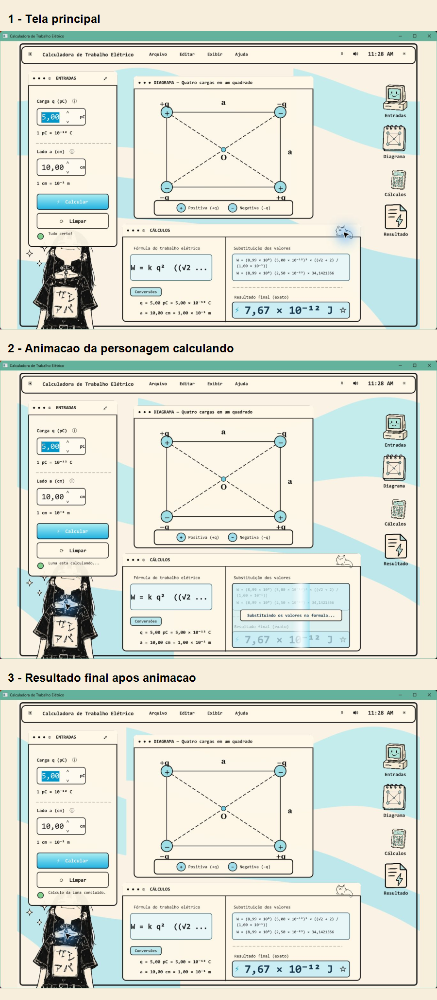

# Calculadora de Trabalho Eletrico - JavaFX Retro

Aplicacao desktop em **Java 21 + JavaFX** para calcular o trabalho eletrico de um sistema de quatro cargas nos vertices de um quadrado.

A interface usa uma estetica retro desktop, com fundo animado, paineis responsivos por escala proporcional, diagrama das cargas, resultado em notacao cientifica e sprites/atalhos clicaveis.

## Prints

### Tela principal



### Visao com os tres estados



## Formula usada

```text
W = k q^2 ((sqrt(2) + 2) / a)
```

Entradas:

- `q` em picoCoulombs (`pC`);
- `a` em centimetros (`cm`).

Conversoes:

```text
q(C) = q(pC) x 10^-12
a(m) = a(cm) x 10^-2
k = 8,99 x 10^9
```

Exemplo padrao:

```text
q = 5,00 pC
a = 10,00 cm
W = 7,67 x 10^-12 J
```

## Recursos

- fundo retro animado em JavaFX `Canvas`;
- layout responsivo por escala proporcional, sem cortar os paineis;
- campos com entrada em virgula ou ponto;
- validacao para valores invalidos;
- diagrama das quatro cargas;
- painel de formula, conversoes e substituicao;
- sprites e icones clicaveis com hover, destaque e status;
- fallback de renderizacao por software para evitar janela branca em alguns ambientes Windows.

## Estrutura

```text
src/
`-- main/
    |-- java/
    |   `-- br/com/ryan/trabalhoeletrico/Main.java
    `-- resources/
        |-- css/style.css
        `-- assets/
            |-- garota.png
            |-- gato.png
            |-- brilhos.png
            |-- computador_retro.png
            |-- caderno_diagrama.png
            |-- calculadora_fofa.png
            |-- documento_raio.png
            `-- raio.png
screenshots/
|-- tela-principal.png
|-- sprite-personagem.png
|-- icone-resultado.png
`-- prints-juntos.png
```

## Como executar

No Windows PowerShell:

```powershell
.\run.ps1
```

Ou, se o Maven estiver instalado:

```powershell
mvn javafx:run
```

## Como compilar

No Windows PowerShell:

```powershell
.\build.ps1
```

O script baixa o JavaFX SDK se ele ainda nao existir em `lib/` e compila em `out/classes`.

## Como gerar executavel Windows

```powershell
.\package.ps1
```

Saida esperada:

```text
dist/CalculadoraTrabalhoEletrico/CalculadoraTrabalhoEletrico.exe
dist/CalculadoraTrabalhoEletrico-windows.zip
```

## Como gerar app Linux

Em Linux com JDK 21:

```bash
bash package-linux.sh
```
